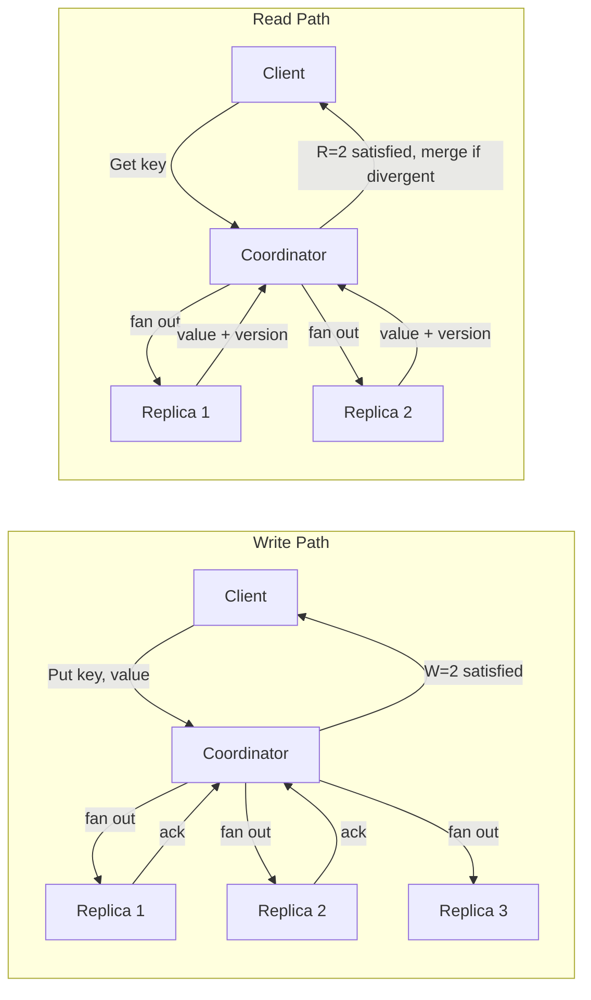
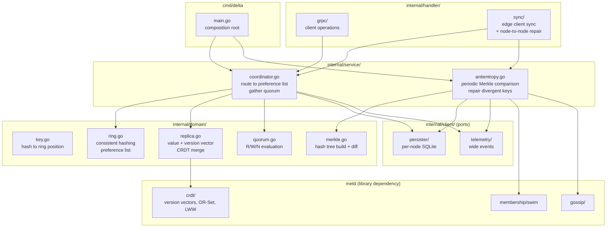
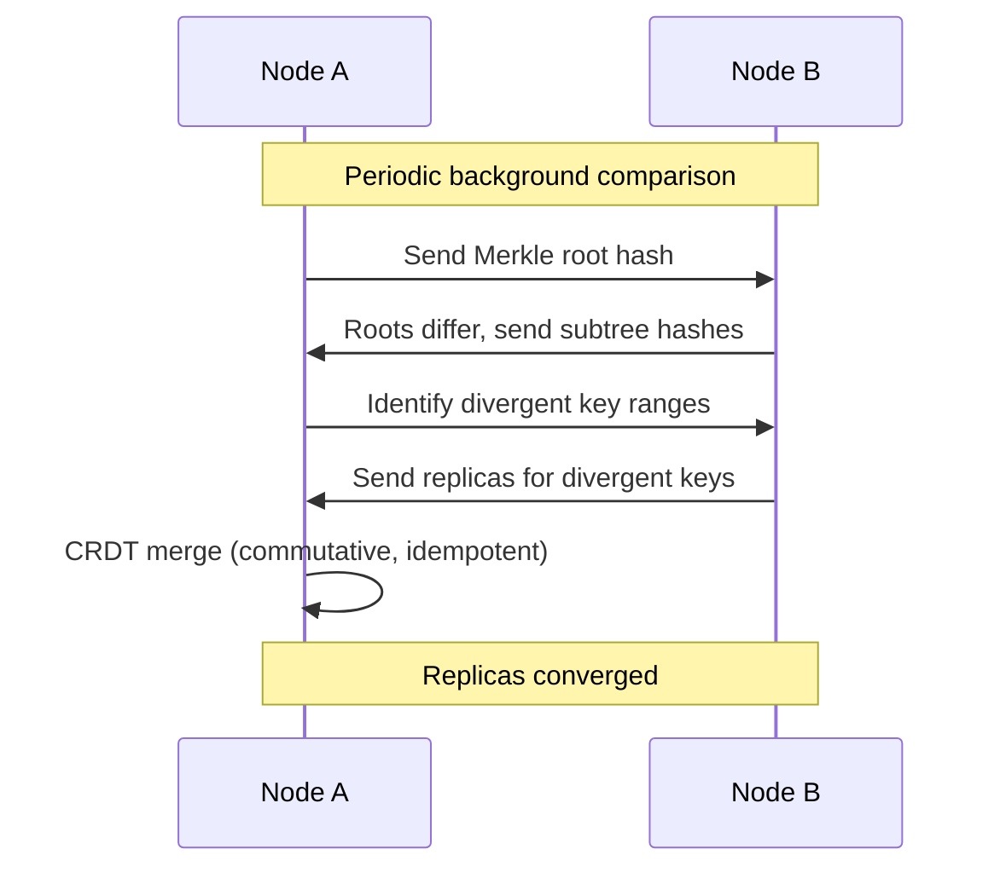
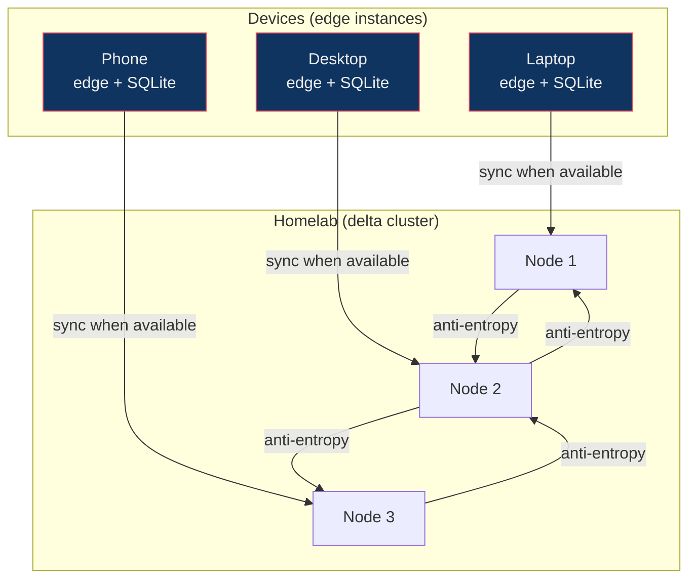

# delta

Leaderless eventually consistent replicated data store.

Single binary, no external dependencies. A consistent hashing ring determines which nodes own which keys. CRDT merge resolves conflicts without coordination. Anti-entropy detects and repairs divergence between replicas in the background. Each read or write specifies how many replicas must respond (R and W) out of the total (N). The caller picks these per request, so a low-stakes preference update can tolerate stale reads while a high-stakes record can require stronger agreement.

## Data Flow

## Architecture

## Consistent Hashing Ring

Every node is hashed to one or more positions on a circular ring of integers (0 to 2^64). To find which nodes own a key, hash the key to a position on the ring and walk clockwise. The first N distinct nodes you encounter are the preference list: the nodes responsible for storing that key's replicas.

This is deterministic. Every node in the cluster can independently compute the same preference list for the same key without any coordination. When a node joins or leaves, only the keys adjacent to its ring positions are affected. Everything else stays where it is.

## Anti-Entropy

Not on the hot path. Background process that guarantees convergence given sufficient time.

## Sync Relay Use Case

delta is never the source of truth. If homelab is down, edge replicas keep working. When it comes back, sync catches up. Partitions are expected, not errors.

## Dependencies

- **meld**: CRDT types, version vectors, gossip transport, SWIM membership. Must be complete.

Observability via Telemetry port (OTel).
