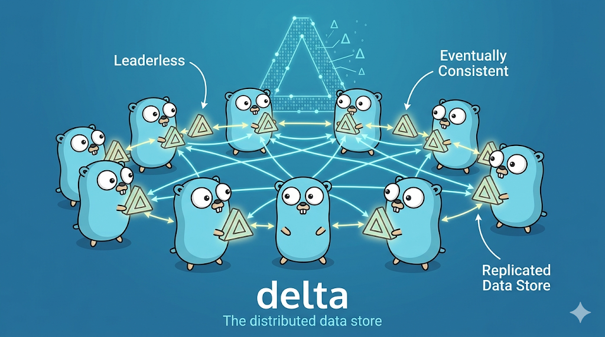
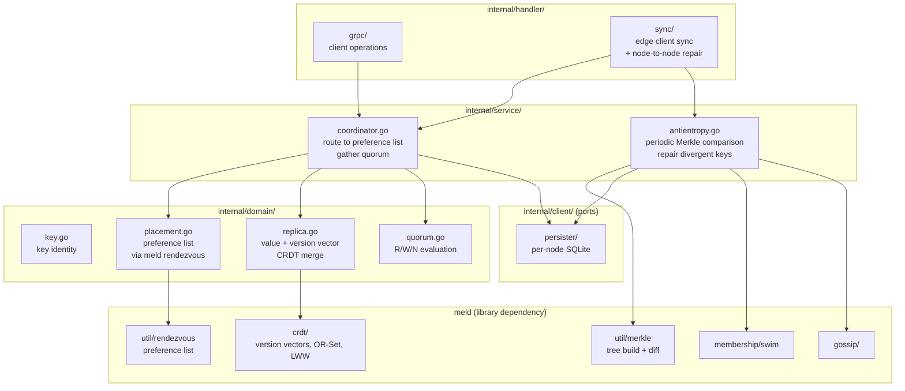
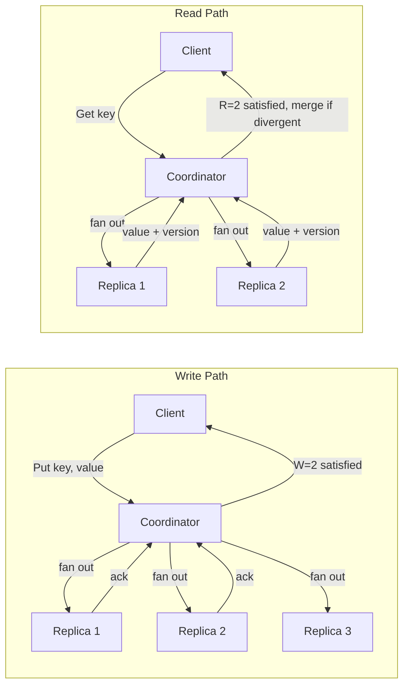
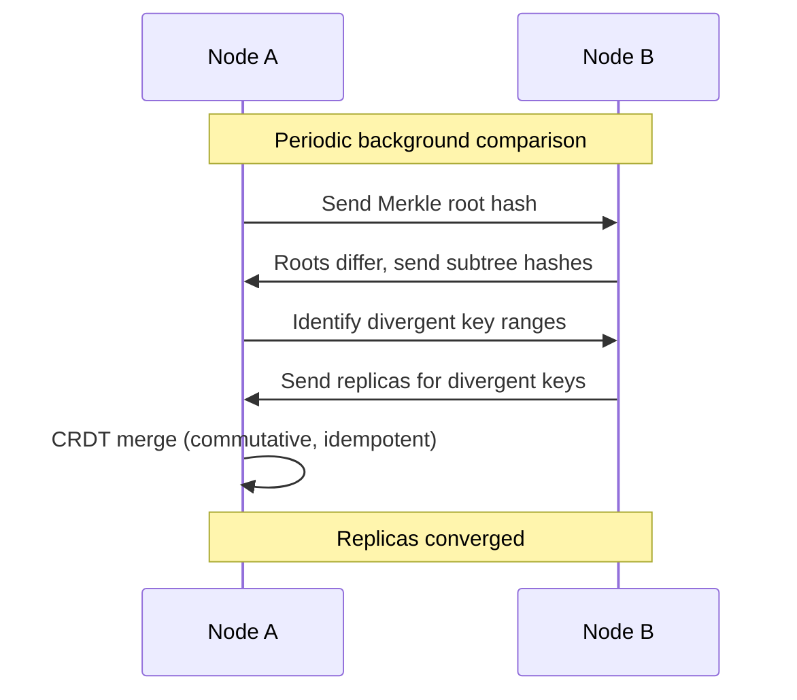
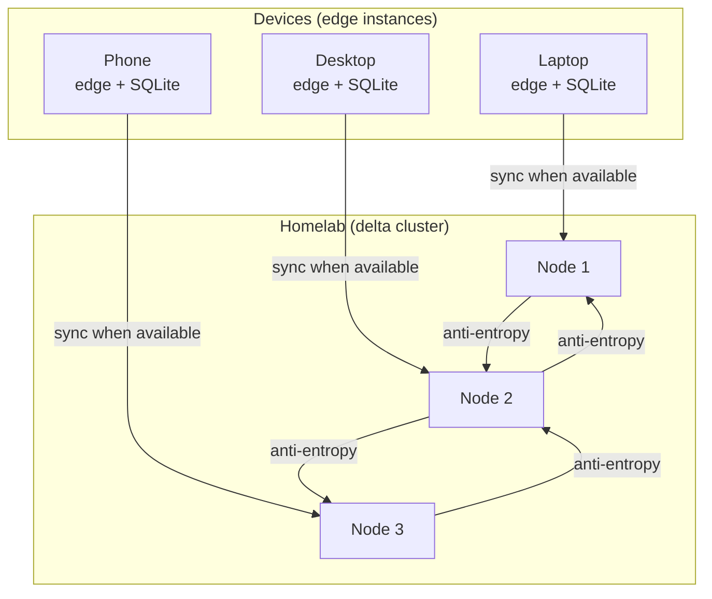

# delta

  

Leaderless eventually consistent replicated data store.

Single binary. Rendezvous hashing determines which nodes own which keys. CRDT merge resolves conflicts without coordination. Anti-entropy detects and repairs divergence between replicas in the background. Each read or write specifies how many replicas must respond (R and W) out of the total (N). The caller picks these per request, so a low-stakes preference update can tolerate stale reads while a high-stakes record can require stronger agreement.

## Architecture

```mermaid
graph TD
    subgraph "internal/domain/"
        KEY[key.go<br/>key identity]
        RING[placement.go<br/>preference list<br/>via meld rendezvous]
        REP[replica.go<br/>value + version vector<br/>CRDT merge]
        QRM[quorum.go<br/>R/W/N evaluation]
    end

    subgraph "internal/service/"
        COORD[coordinator.go<br/>route to preference list<br/>gather quorum]
        AE[antientropy.go<br/>periodic Merkle comparison<br/>repair divergent keys]
    end

    subgraph "internal/handler/"
        GRPC[grpc/<br/>client operations]
        SYNC[sync/<br/>edge client sync<br/>+ node-to-node repair]
    end

    subgraph "internal/client/ (ports)"
        PER[persister/<br/>per-node SQLite]
    end

    subgraph "meld (library dependency)"
        CRDT[crdt/<br/>version vectors, OR-Set, LWW]
        MEMB[membership/swim]
        GOSSIP[gossip/]
        RDV[util/rendezvous<br/>preference list]
        MRKL[util/merkle<br/>tree build + diff]
    end

    COORD --> RING
    COORD --> REP
    COORD --> QRM
    COORD --> PER
    RING --> RDV
    AE --> MRKL
    AE --> PER
    GRPC --> COORD
    SYNC --> COORD
    SYNC --> AE
    REP --> CRDT
    AE --> MEMB
    AE --> GOSSIP
```

## Data Flow

```mermaid
graph LR
    subgraph "Write Path"
        C1[Client] -->|Put key, value| COORD[Coordinator]
        COORD -->|fan out| R1[Replica 1]
        COORD -->|fan out| R2[Replica 2]
        COORD -->|fan out| R3[Replica 3]
        R1 -->|ack| COORD
        R2 -->|ack| COORD
        COORD -->|W=2 satisfied| C1
    end

    subgraph "Read Path"
        C2[Client] -->|Get key| COORD2[Coordinator]
        COORD2 -->|fan out| R4[Replica 1]
        COORD2 -->|fan out| R5[Replica 2]
        R4 -->|value + version| COORD2
        R5 -->|value + version| COORD2
        COORD2 -->|R=2 satisfied, merge if divergent| C2
    end
```

## Placement (rendezvous hashing)

To find which nodes own a key, delta uses meld rendezvous hashing: score every node by hash(node, key) and take the top N. Those N nodes are the preference list, the nodes responsible for that key's replicas. delta consumes meld util/rendezvous (the top-N AssignN variant) rather than building its own ring.

This is deterministic. Every node independently computes the same preference list for the same key and node set, with no coordination. When a node joins or leaves, rendezvous moves only the keys that named that node, so disruption is minimal: the same property a consistent-hashing ring gives, but without virtual nodes or ring rebalancing.

## Anti-Entropy

```mermaid
sequenceDiagram
    participant A as Node A
    participant B as Node B

    Note over A,B: Periodic background comparison
    A->>B: Send Merkle root hash
    B->>A: Roots differ, send subtree hashes
    A->>B: Identify divergent key ranges
    B->>A: Send replicas for divergent keys
    A->>A: CRDT merge (commutative, idempotent)
    Note over A,B: Replicas converged
```

Not on the hot path. Background process that guarantees convergence given sufficient time.

## Sync Relay Use Case

```mermaid
graph TD
    subgraph "Devices (edge instances)"
        L[Laptop<br/>edge + SQLite]
        D[Desktop<br/>edge + SQLite]
        P[Phone<br/>edge + SQLite]
    end

    subgraph "Homelab (delta cluster)"
        N1[Node 1]
        N2[Node 2]
        N3[Node 3]
    end

    L -->|sync when available| N1
    D -->|sync when available| N2
    P -->|sync when available| N3
    N1 -->|anti-entropy| N2
    N2 -->|anti-entropy| N1
    N2 -->|anti-entropy| N3
    N3 -->|anti-entropy| N2
```

delta is never the source of truth. If homelab is down, edge replicas keep working. When it comes back, sync catches up. Partitions are expected, not errors.
